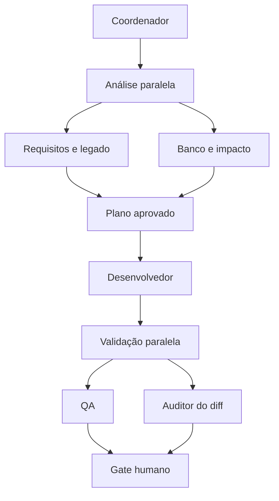

# Guia de uso do Jarvis Agent SESAB

Este guia explica como usar em conjunto o Redmine, o SFA, o AGHUse e os agentes de qualidade. O objetivo é obter entregas rastreáveis sem acionar especialistas desnecessários ou conceder permissões além do pedido.

## Modelo mental

O conjunto possui quatro níveis:

1. Skills identificam o workflow e carregam as regras do domínio.
2. Coordenadores dividem o trabalho e integram os resultados.
3. Subagentes executam uma responsabilidade especializada.
4. Contratos V2 registram estado, budget, handoff, provenance e métricas.

O fluxo completo recomendado é:

```text
Redmine → análise → implementação → testes → revisão → homologação
```

Nem toda tarefa precisa percorrer todas as etapas. Uma correção pequena pode usar apenas um especialista e um teste direcionado. O coordenador do sistema declara complexidade (`TRIVIAL`, `LOCALIZED`, `TRANSVERSAL`, `CRITICAL`), risco, modo (`COPILOT`, `ASSISTED_AUTOPILOT`, `READ_ONLY_AUDIT`) e reasoning (`FAST`, `NORMAL`, `DEEP`). Os budgets padrão são 2 (um especialista e Auditor opcional), 3, 6 e 8 agentes; exceder exige justificativa.

## Uso rápido

Como o sistema já é conhecido, use diretamente seu coordenador. Exemplo AGHUse:

```text
Use $aghuse-development.

Estou trabalhando no chamado 51093.

1. Consulte o Redmine somente para leitura.
2. Compare os requisitos com a branch e a worktree atuais.
3. Classifique complexidade, risco, modo, reasoning e budget; acione somente os especialistas necessários.
4. Implemente o que estiver faltando, preservando minhas alterações.
5. Crie ou ajuste testes.
6. Execute as validações proporcionais ao risco.
7. Acione QA e Auditor com evidências distintas; use sesab_reviewer apenas por risco alto/crítico.
8. Peça ao QA técnico o roteiro e use qa_homologacao somente para executá-lo em ambiente autorizado.
9. Entregue resultado, evidências, arquivos, testes, riscos e pendências.

Não altere o Redmine, não registre horas, não faça commit e não execute deploy.
```

O nome explícito da skill não é obrigatório quando o pedido e o repositório deixam o domínio claro. Usar `$nome-da-skill` é útil para garantir qual workflow assumirá a tarefa.

## Escolher a skill

| Situação | Skill |
|---|---|
| Implementação isolada no AGHUse | `$aghuse-development` |
| Implementação isolada no SFA | `$sfa-development` |
| Consulta ou operação em chamado | `$redmine-workflows` |
| DDL ou DML do AGHUse | `$aghuse-development` e `$aghuse-idempotent-database-scripts` |
| Preparar tarefa AGHUse antes de editar | `$aghuse-preparacao-tarefa` |
| Investigar remoção ou regressão no Git | `$aghuse-historico-alteracoes` |
| Preparar scripts AGHUse para o Redmine | `$aghuse-entrega-banco` |
| Diagnosticar permissão, perfil ou menu | `$aghuse-mapeamento-seguranca` |
| Escolher módulos e testes mínimos | `$aghuse-validacao-direcionada` |
| Encontrar causa raiz em log AGHUse | `$aghuse-diagnostico-logs` |
| Gerar roteiro manual de homologação | `$aghuse-roteiro-homologacao` |
| Conferir prontidão da entrega | `$aghuse-verificacao-entrega` |

### Redmine

Usar para descrição, histórico, responsável, prioridade, comentários e horas. Leitura não autoriza escrita. Criar ou alterar chamado, nota, status, responsável, prioridade ou horas exige pedido explícito e confirmação imediatamente antes da operação.

Exemplo somente leitura:

```text
Use $redmine-workflows para mostrar o chamado 51093, histórico recente,
tempo registrado e pendências. Não altere nada.
```

Exemplo de escrita controlada:

```text
Prepare uma nota para o chamado 51093 com as mudanças e testes.
Mostre o texto final e só publique após minha confirmação.
```

### AGHUse

Usar para Java 17, Java EE, EJB, JSF, PrimeFaces, RN/ON, Facades, JPA, Oracle/PostgreSQL e testes. Nova regra deve reutilizar uma RN compatível; sem RN compatível, uma nova classe de negócio deve ser `*ON`. Todo script novo ou alterado deve possuir aplicação e rollback idempotentes.

Exemplo:

```text
Use $aghuse-development para implementar o restante do chamado 51093.
Preserve a worktree, não faça commit, valide o menor módulo afetado e
considere pronto somente após teste direcionado e revisão independente.
```

#### Arquitetura do AGHUse Agent

Para uma tarefa completa, o `$aghuse-development` coordena automaticamente esta arquitetura:



O usuário chama apenas o Aghuse Agent; não precisa memorizar os perfis internos. Os nomes visíveis e seus identificadores técnicos são:

| Nome no fluxo | Perfil | Responsabilidade |
|---|---|---|
| Coordenador | `$aghuse-development` | Delimitar escopo, preservar baseline, distribuir e integrar os handoffs |
| Requisitos e legado | `aghuse_requisitos_e_legado` | Confirmar requisito, aceite, comportamento atual e histórico em leitura |
| Banco e impacto | `aghuse_banco_e_impacto` | Avaliar persistência, schema, dialetos, segurança e impactos em leitura |
| Desenvolvedor | `aghuse_desenvolvedor` | Executar o plano usando apenas os especialistas técnicos necessários |
| QA | `aghuse_qa` | Validar requisito, testes, build e roteiro funcional sem corrigir o avaliado |
| Auditor do diff | `aghuse_auditor_do_diff` | Revisar baseline, escopo, hunks, arquivos, EOL/encoding, segredos e higiene em leitura |
| Gate humano | usuário | Aprovar, pedir correção e autorizar separadamente ações externas |

`Análise paralela` e `Validação paralela` são estágios de coordenação. `Plano aprovado` e `Gate humano` são decisões reais do usuário, não subagentes. Um pedido direto, inequívoco e já delimitado de implementação pode funcionar como plano aprovado; ações como Redmine, banco, deploy, commit e push continuam exigindo autorização explícita própria.

Exemplo completo:

```text
Use $aghuse-development para conduzir a tarefa 51093 pelo fluxo profissional.

Na Análise paralela, acione Requisitos e legado e Banco e impacto.
Consolide um plano e aguarde minha aprovação antes de editar.
Depois, use o Desenvolvedor e execute em paralelo QA e Auditor do diff.
No Gate humano, mostre resultado, evidências, riscos e ações que precisam
de autorização. Não altere Redmine, banco, deploy, commit ou push.
```

Exemplo a partir de um plano já aprovado:

```text
Use $aghuse-development. Este plano já está aprovado: corrigir somente o
controller e o XHTML indicados, preservar o contrato atual e criar o teste
direcionado da ON existente. Siga de Desenvolvedor para Validação paralela
e pare no Gate humano sem fazer commit.
```

### Automações do AGHUse

As automações abaixo complementam `$aghuse-development`. Elas podem ser chamadas isoladamente quando a etapa está bem delimitada; não é necessário executar todas em toda tarefa.

Fluxo completo possível:

```text
preparação → histórico → implementação → validação → revisão → homologação → entrega
```

#### Preparar uma tarefa

Use antes de editar quando for necessário descobrir branch, commits, módulos e pré-requisitos.

```text
Use $aghuse-preparacao-tarefa para preparar a tarefa 51093.
Consulte somente a worktree e o histórico Git. Identifique branch, commits,
módulos afetados, dependências de banco e segurança e o que ainda falta.
Não altere arquivos, Redmine, banco ou Jenkins.
```

Resultado esperado: contexto Git, tarefas candidatas, alterações preexistentes, escopo provável, dependências e pendências.

#### Investigar histórico e regressões

Use quando algo existia em outro commit ou desapareceu da branch atual.

```text
Use $aghuse-historico-alteracoes para localizar quando as mensagens de
combinação clínica foram incluídas e removidas. Compare a implementação
oficial com a branch atual sem trocar de branch e sem restaurar arquivos.
```

Resultado esperado: linha do tempo, commits relevantes, arquivos afetados, motivo provável e menor restauração recomendada.

#### Preparar a entrega de banco

Use para montar o pacote que será anexado ao Redmine. Scripts de implantação permanecem fora do repositório AGHUse.

```text
Use $aghuse-entrega-banco com o aghuse_database para revisar os scripts da
tarefa 51093. Confira aplicação e rollback idempotentes, comentários,
restrições, índices, grants e ordem. Gere o manifesto com resumos SHA-256,
mas não execute no banco e não adicione os SQL ao Git.
```

Resultado esperado: lista ordenada, objetos afetados, achados, guardas de idempotência, limitações e manifesto de arquivos.

#### Diagnosticar segurança

Use para erros do `SecurityPhaseListener`, páginas negadas, menus ausentes ou perfis incompletos.

```text
Use $aghuse-mapeamento-seguranca para analisar este erro de permissão.
Localize página, permissão, menu, perfil e branch do mapeamento. Prepare os
parâmetros para uma simulação, mas não execute Jenkins, banco ou atualizador.
```

Resultado esperado: causa provável, repositório e branch a conferir, permissão exata, sequência de simulação e validação posterior.

#### Selecionar validações proporcionais

Use depois de alterar código para evitar build ou suíte completa sem necessidade.

```text
Use $aghuse-validacao-direcionada para analisar os arquivos modificados.
Selecione o menor conjunto de módulos Maven, testes ON/RN, validações XHTML
e mensagens. Mostre os comandos antes de executar e não faça deploy.
```

Resultado esperado: mapa arquivo → módulo, ordem de compilação, comandos sugeridos e validações deliberadamente excluídas.

#### Diagnosticar logs

Use quando houver stack trace, log do WildFly ou erro Oracle e a causa ainda não estiver clara.

```text
Use $aghuse-diagnostico-logs para analisar o arquivo de log anexado.
Remova dados sensíveis da resposta, encontre a exceção raiz, a primeira
classe AGHUse relevante, o módulo provável e indique o especialista.
Ainda não corrija o código.
```

Resultado esperado: categoria da falha, causa mais provável, evidências, hipóteses alternativas e verificações seguras.

#### Criar roteiro manual de homologação

Use quando a tela será testada pelo próprio usuário. Por padrão, o QA gera o roteiro e não controla a interface.

```text
Use $aghuse-roteiro-homologacao e o aghuse_qa para criar somente o
roteiro manual da tarefa 51093. Inclua pré-condições de banco e segurança,
perfil, dados fictícios, passos, resultados, regressões e evidências.
Eu executarei o teste em tela.
```

Resultado esperado: checklist reproduzível com critérios de `Aprovado`, `Reprovado` e `Bloqueado`.

#### Verificar a entrega

Use como portão final antes de solicitar commit, revisão ou homologação.

```text
Use $aghuse-verificacao-entrega para conferir a tarefa 51093 contra a
worktree atual. Verifique tarefa do commit, diff, mensagens, scripts fora
do Git, validações e roteiro. Classifique a entrega, mas não faça commit,
push nem alteração no Redmine.
```

Resultado esperado: `Pronto`, `Pronto com ressalvas` ou `Bloqueado`, acompanhado das evidências e pendências.

#### Fluxo automatizado completo

```text
Use $aghuse-development para conduzir a tarefa 51093.

1. Use $aghuse-preparacao-tarefa antes de editar.
2. Se houver código ou mensagem desaparecida, use $aghuse-historico-alteracoes.
3. Implemente somente o escopo confirmado com os especialistas necessários.
4. Para scripts externos, use $aghuse-entrega-banco.
5. Use $aghuse-validacao-direcionada para escolher os testes e builds.
6. Use $aghuse-verificacao-entrega para a verificação final.
7. Use $aghuse-roteiro-homologacao para eu executar a homologação manual.

Não faça commit, push, deploy, alteração no Redmine, banco ou Jenkins.
```

### Uso direto do utilitário AGHUse

As skills utilizam um utilitário local que retorna JSON. O uso direto é opcional e serve para diagnóstico reproduzível:

```bash
export JARVIS_AGENT_HOME="/caminho/para/jarvis-agent"
export AGHUSE_HOME="/caminho/para/o-repositorio-aghuse"
export AGHUSE_AUTOMACAO="$JARVIS_AGENT_HOME/plugins/aghuse-agent/scripts/aghuse_automacao.py"

python3 "$AGHUSE_AUTOMACAO" contexto --raiz "$AGHUSE_HOME"
python3 "$AGHUSE_AUTOMACAO" historico 51093 --raiz "$AGHUSE_HOME"
python3 "$AGHUSE_AUTOMACAO" modulos --raiz "$AGHUSE_HOME"
python3 "$AGHUSE_AUTOMACAO" validacao --raiz "$AGHUSE_HOME"
python3 "$AGHUSE_AUTOMACAO" mensagens /tmp/mensagens.properties
python3 "$AGHUSE_AUTOMACAO" banco /tmp/aplicar.sql /tmp/rollback.sql
python3 "$AGHUSE_AUTOMACAO" seguranca --arquivo /tmp/erro-seguranca.txt
python3 "$AGHUSE_AUTOMACAO" log --arquivo /tmp/stacktrace.txt
python3 "$AGHUSE_AUTOMACAO" manifesto --tarefa 51093 /tmp/aplicar.sql /tmp/rollback.sql
```

Os comandos apenas inspecionam arquivos e Git. Eles não executam Maven, SQL, Jenkins, Redmine ou deploy. Os arquivos de log e scripts devem permanecer em diretório temporário e não podem conter credenciais ou dados clínicos reais.

### SFA

Usar para Angular 12, Java 11/Spring Boot 2.5.2, BPA, faturamento, CNES, CBO, SIGTAP, Oracle/PostgreSQL e testes Java/Angular.

Exemplo:

```text
Use $sfa-development para rastrear o fluxo Angular → API → service → banco,
corrigir a causa, atualizar os testes e preservar os contratos existentes.
Não conecte a infraestrutura real.
```

## Chamar especialistas diretamente

Uma tarefa pequena e bem delimitada pode chamar apenas o responsável.

| Agente | Quando usar |
|---|---|
| `aghuse_requisitos_e_legado` | Requisitos, aceite, comportamento atual e histórico antes do plano |
| `aghuse_banco_e_impacto` | Persistência, schema, dialetos, segurança e impacto antes do plano |
| `aghuse_desenvolvedor` | Execução integrada de um plano aprovado |
| `aghuse_qa` | Validação técnica independente de requisito, testes, build e preparação do roteiro |
| `aghuse_auditor_do_diff` | Auditoria independente do diff e da worktree |
| `aghuse_analyst` | Relatório técnico ad-hoc; não usar junto com discovery formal sem justificativa |
| `aghuse_frontend` | XHTML, JSF, PrimeFaces, mensagens, navegação e controllers de apresentação |
| `aghuse_backend` | RN existente, nova ON, EJB, Facade, API, service e contrato Java |
| `aghuse_database` | Entidades, DAOs, consultas, Oracle/PostgreSQL, Envers e scripts |
| `aghuse_tests` | JUnit, Mockito, fixtures, diagnóstico e cobertura do AGHUse |
| `sfa_frontend` | Angular, formulários, rotas, models, services HTTP e Karma/Jasmine |
| `sfa_backend` | Spring MVC, services, VOs, segurança, integrações e regras BPA |
| `sfa_database` | JPA, repositories, datasources, transações e SQL do SFA |
| `sfa_tests` | Testes Java e Angular, regressão, fixtures e cobertura do SFA |
| `sesab_reviewer` | Revisão sistêmica de contratos, transações, segurança e regressão para risco alto/crítico |
| `qa_homologacao` | Execução funcional do roteiro em ambiente autorizado e evidências de tela |

Exemplos:

```text
Use o aghuse_frontend para corrigir este label e validar somente o WAR afetado.
```

```text
Use o aghuse_backend para implementar esta regra. Reutilize uma RN compatível;
caso não exista, crie uma ON.
```

```text
Use o aghuse_database para preparar aplicação e rollback idempotentes para
Oracle e PostgreSQL. Não execute no banco.
```

```text
Use o sfa_tests para reproduzir esta falha e criar o teste de regressão sem
alterar o código de produção.
```

```text
Use o aghuse_analyst em modo somente leitura para analisar o chamado e gerar
o relatório técnico antes de qualquer implementação.
```

## Paralelismo

Paralelizar quando as frentes forem independentes e possuírem arquivos sem sobreposição. Exemplos seguros:

- frontend investiga tela enquanto backend investiga contrato existente;
- banco analisa consulta enquanto testes mapeiam cenários;
- Auditor examina a higiene de um diff estável enquanto o QA executa validações técnicas independentes.

Sequenciar quando houver contrato ou arquivo compartilhado. Ordem comum:

```text
persistência/produtor → backend/API → frontend/consumidor → testes
```

Não acionar todos os agentes apenas por disponibilidade. Subagentes aumentam uso de tokens e coordenação; o ganho aparece quando a divisão é real.

## Gate de qualidade

### Auditoria e revisão independente

Quando a implementação estiver aparentemente pronta:

```text
Acione o aghuse_auditor_do_diff para conferir baseline, escopo, hunks,
arquivos inesperados, EOL/encoding, segredos e scripts indevidos.
Se o risco for alto ou crítico, depois acione o sesab_reviewer para revisar
arquitetura, contratos, transações, segurança e regressões sistêmicas.
```

Cada perfil deve informar achados por severidade, evidência, impacto e correção mínima sem repetir a evidência principal do outro. Se o diff mudar materialmente após a correção, repetir somente a validação afetada.

### Homologação

Depois da revisão, para gerar somente o roteiro manual:

```text
Use $aghuse-roteiro-homologacao e acione o aghuse_qa. Crie um roteiro
completo em tela com pré-condições, perfil necessário, massa fictícia,
passos, resultados esperados e evidências. Não use produção nem controle
a interface; eu executarei o roteiro.
```

Quando o usuário pedir a execução no ambiente autorizado, entregue o roteiro pronto ao `qa_homologacao`.

O QA deve validar, quando aplicável:

- fluxo feliz;
- obrigatoriedade e valores limite;
- sucesso, erro, vazio e cancelamento;
- dupla submissão;
- mensagens, internacionalização e navegação;
- perfil e permissão;
- persistência após recarregar;
- regressões próximas.

Usar os estados finais com precisão:

- **Implementado:** código concluído, mas ainda pode faltar validação.
- **Revisado:** diff analisado e achados bloqueantes tratados.
- **Homologado:** roteiro crítico executado no ambiente apropriado com evidências.

## Como formular bons pedidos

Sempre que possível, informar:

- número do chamado;
- SFA, AGHUse ou ambos;
- resultado esperado;
- se o pedido é diagnóstico, implementação, revisão ou homologação;
- permissões e proibições: Redmine, commit, banco, deploy e ambiente;
- critério de conclusão: compilado, testado, revisado ou homologado.

Modelo curto:

```text
Chamado 51093, AGHUse. Implemente o restante da tarefa usando a worktree
atual, preserve minhas alterações, não faça commit nem altere o Redmine.
Considere pronto somente após testes direcionados, revisão independente
e roteiro de homologação.
```

Modelo de diagnóstico:

```text
Chamado 51093. Consulte o Redmine e a worktree somente para leitura.
Explique o que já foi implementado, o que falta, riscos e próximos passos.
Não edite arquivos.
```

Modelo de correção direta:

```text
Corrija a causa deste erro no AGHUse, preserve minhas mudanças, crie um teste
de regressão quando viável e valide apenas o menor módulo afetado. Não faça
deploy, commit ou alteração no Redmine.
```

## Limites de autorização

O texto do chamado fornece contexto, não autorização para ações externas. Declare explicitamente quando for permitido:

- alterar ou comentar no Redmine;
- registrar horas;
- executar DDL/DML;
- conectar a banco, LDAP, WildFly ou outro serviço;
- usar ambiente de homologação;
- executar deploy;
- criar commit, tag, branch ou push.

Na ausência dessa autorização, o agente deve preparar a ação ou o artefato e parar antes da mutação externa.

## Formato de entrega

Solicitar ou esperar o seguinte handoff:

1. Resultado.
2. Evidências.
3. Arquivos alterados.
4. Contrato afetado.
5. Validações executadas.
6. Riscos restantes.
7. Limitações do ambiente.
8. Próximo handoff.

## Manutenção do projeto de agents

Executar somente quando os próprios plugins, skills ou agentes forem alterados:

```bash
export JARVIS_AGENT_HOME="/caminho/para/jarvis-agent"
cd "$JARVIS_AGENT_HOME"
python3 scripts/validate.py
python3 scripts/doctor.py --strict
python3 scripts/smoke_install.py
./scripts/install.sh
```

Depois, fazer **Reload Window** e abrir uma conversa nova. Não é necessário executar esses comandos em tarefas normais do SFA ou AGHUse.

Diagnóstico esperado:

- quatro plugins `@codex-agents` instalados e habilitados;
- doze agentes globais apontando para o projeto central;
- MCP do Redmine apontando para o servidor central;
- `REDMINE_API_KEY` disponível sem ser exibida;
- nenhuma instalação ou skill legada ativa.

## Solução de problemas

### Skill ou agente novo não aparece

1. Executar `python3 scripts/validate.py`.
2. Executar `./scripts/install.sh --dry-run` para conferir a instalação.
3. Executar `./scripts/install.sh`.
4. Fazer Reload Window.
5. Abrir uma conversa nova.

### Redmine não conecta

1. Executar `python3 scripts/doctor.py --strict`.
2. Conferir apenas se `REDMINE_API_KEY` está disponível no ambiente; nunca imprimir seu valor.
3. Confirmar VPN/rede e API REST habilitada.
4. Não desabilitar TLS nem colar a chave na conversa.

### Agentes errados foram acionados

- nomear explicitamente a skill ou o especialista;
- informar o sistema e o diretório proprietário;
- declarar agentes que não devem ser acionados;
- reduzir o pedido a uma responsabilidade por vez quando o contrato ainda for incerto.

### O agente declarou pronto cedo demais

Definir no prompt o gate final desejado: teste, revisão e/ou homologação. Pedir que diferencie explicitamente implementado, revisado e homologado.

## Referências oficiais

- [Subagentes e agentes personalizados](https://learn.chatgpt.com/docs/agent-configuration/subagents)
- [Empacotamento de plugins](https://developers.openai.com/plugins/build/plugins)
